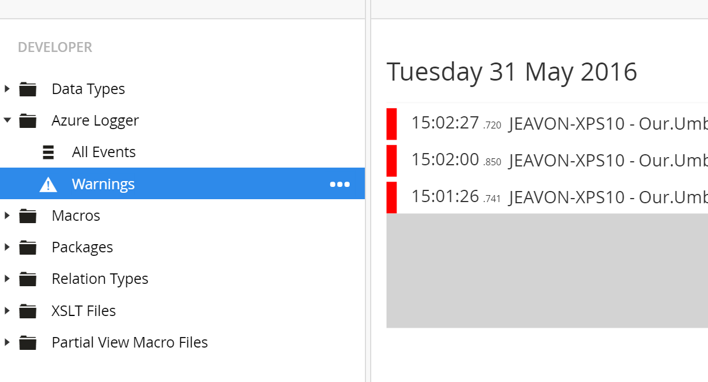

# Umbraco Azure Logger

This Umbraco package adds a appender for log4net that uses a Azure Storage table instead of the file system to store your Umbraco logs. Also included is a  UI for viewing and querying your log4net entries.

Once installed, edit the ConnectionString named "LoggingTableStorage" added to web.config include the name and key of your Azure storage account (ensure the account has the Table service enabled).

If your site is making a lot of log entries (e.g. you've set to DEBUG level) you should adjust the bufferSize value, this sets how often the logs are written to storage.

Example:

	  <root>
	    <priority value="Info"/>
	    <appender-ref ref="AsynchronousLog4NetAppender" />
	    <appender-ref ref="AllTableAppender"/>
	    <appender-ref ref="WarningsTableAppender"/>
	  </root>

	  <appender name="AllTableAppender" type="Our.Umbraco.AzureLogger.Core.TableAppender, Our.Umbraco.AzureLogger.Core">
	    <param name="ConnectionString" value="LoggingTableStorage"/>
	    <param name="TableName" value="UALUmbracoTraceLog"/>
	    <param name="TreeName" value="All Events"/>
	    <bufferSize value="5"/>
	    <!-- 0 indexed -->
	  </appender>

	  <appender name="WarningsTableAppender" type="Our.Umbraco.AzureLogger.Core.TableAppender, Our.Umbraco.AzureLogger.Core">
	    <param name="ConnectionString" value="LoggingTableStorage"/>
	    <param name="TableName" value="UALWarnings"/>
	    <param name="TreeName" value="Warnings"/>
	    <param name="IconName" value="icon-alert"/>
	    <threshold value="WARN"/>
	    <filter type="log4net.Filter.LevelRangeFilter">
	      <levelMin value="WARN"/>
	      <levelMax value="ERROR"/>
	    </filter>
	    <bufferSize value="0"/>
	    <!-- 1 item in buffer -->
	  </appender>

As a useful enhancement we also now store to URL which triggered the log entry to be made, this can be very handy for tracking down issues.

## Installation ##

Currently only NuGet packages are available

|NuGet Packages    |Version           |
|:-----------------|:-----------------|
|**Release**|
|**Pre-release**|

This Umbraco package adds a log4net appender that uses Azure table storage and extends the Umbraco developer tree with functionality to view these logs. 

Using Azure table storage for logs in preference to the file-system has an additional benefit of reducing file replication activity in load balanced environments where the file system is being synchronised such as Azure Web Apps.

Once installed, edit the ConnectionString named "LoggingTableStorage" added to web.config include the name and key of your Azure storage account (ensure the account has the Table service enabled).

If your site is making a lot of log entries (e.g. you've set to DEBUG level) you should adjust the bufferSize value, this sets how often the logs are written to storage.

Example:

	  <root>
	    <priority value="Info"/>
	    <appender-ref ref="AsynchronousLog4NetAppender" />
	    <appender-ref ref="AllTableAppender"/>
	    <appender-ref ref="WarningsTableAppender"/>
	    <appender-ref ref="ReadOnlyTableAppender"/> <!-- enable the ui to read the logs, but prevent this server from writing -->
	  </root>

	  <appender name="AllTableAppender" type="Our.Umbraco.AzureLogger.Core.TableAppender, Our.Umbraco.AzureLogger.Core">
	    <param name="ConnectionString" value="LoggingTableStorage"/>
	    <param name="TableName" value="UALUmbracoTraceLog"/>
	    <param name="TreeName" value="All Events"/>
	    <bufferSize value="5"/><!-- 0 indexed -->
	  </appender>

	  <appender name="WarningsTableAppender" type="Our.Umbraco.AzureLogger.Core.TableAppender, Our.Umbraco.AzureLogger.Core">
	    <param name="ConnectionString" value="LoggingTableStorage"/>
	    <param name="TableName" value="UALWarnings"/>
	    <param name="TreeName" value="Warnings"/>
	    <param name="IconName" value="icon-alert"/>
	    <threshold value="WARN"/>
	    <filter type="log4net.Filter.LevelRangeFilter">
	      <levelMin value="WARN"/>
	      <levelMax value="ERROR"/>
	    </filter>
	    <bufferSize value="0"/><!-- 1 item in buffer -->
	  </appender>
	  
	  <appender name="ReadOnlyTableAppender" type="Out.Umbraco.AzureLogger.Core.TableAppender, Our.Umbraco.AzureLogger.Core">
	    <param name="ConnectionString" value="LoggingTableStorage"/>
	    <param name="TableName" value="UALReadOnly"/>
	    <param name="ReadOnly" value="true"/>
	  </appneder>

The ConnectionString param can either be the actual connection string, or a name of a connection string as set in web.config:

	  <connectionStrings>
	    <!-- local Azure Storage Emulator -->
	    <add name="LoggingTableStorage" connectionString="UseDevelopmentStorage=true" />
	  </connectionStrings>

As a useful enhancement we also now store to URL and SessionId which triggered the log entry to be made, this can be very handy for tracking down issues.

## Installation ##

NuGet & Umbraco packages are available

|NuGet Packages    |Version           |
|:-----------------|:-----------------|
|**Release**|
|**Pre-release**|

|Umbraco Packages  |                  |
|:-----------------|:-----------------|
|**Release**| 
|**Pre-release**| 

## Licensing ##

This project is licensed under the [Apache 2.0 license](http://www.apache.org/licenses/LICENSE-2.0).

The project includes [WindowsAzure.Storage](https://www.nuget.org/packages/WindowsAzure.Storage/) licensed under the [Apache License](https://raw.githubusercontent.com/WindowsAzure/azure-sdk-for-net/master/LICENSE.txt) and [Microsoft.Web.Xdt](https://www.nuget.org/packages/Microsoft.Web.Xdt) licensed under [MS-EULA license](https://www.microsoft.com/web/webpi/eula/microsoft_web_xmltransform.htm).
